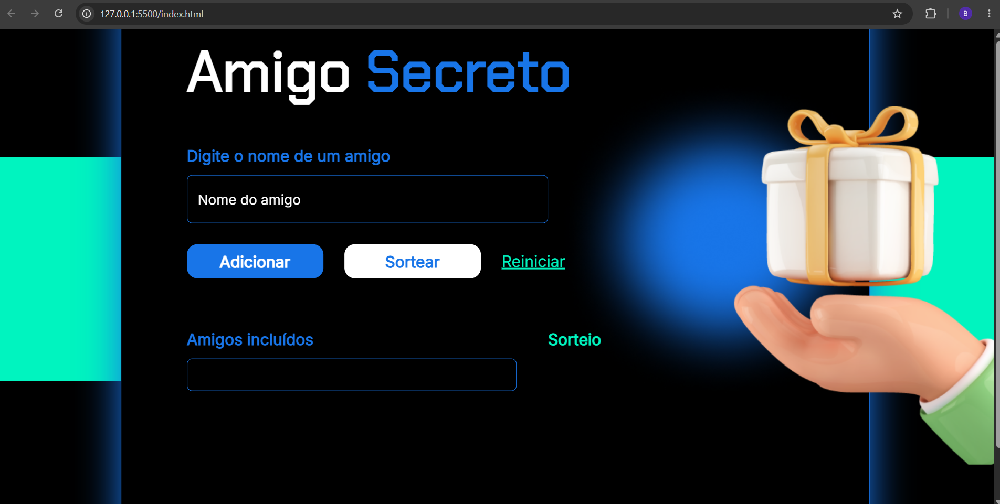

# 🎁 Sorteador de Amigo Secreto

## 📖 Sobre o projeto

O **Sorteador de Amigo Secreto** foi desenvolvido durante o curso **Lógica de Programação com JavaScript**, da Alura.

O objetivo do projeto é permitir que o usuário adicione nomes a uma lista e realize um sorteio aleatório para escolher um participante.

Durante o desenvolvimento foram aplicados conceitos fundamentais de JavaScript, como manipulação do DOM, arrays, funções, validações e geração de números aleatórios.

---

## 🚀 Funcionalidades

- ✅ Adicionar participantes à lista;
- ✅ Impedir nomes duplicados;
- ✅ Validar campos vazios;
- ✅ Sortear um participante aleatoriamente;
- ✅ Reiniciar a aplicação limpando todos os dados.

---

## 🛠️ Tecnologias utilizadas

- HTML5
- CSS3
- JavaScript

---

## 💡 Conceitos praticados

Durante o desenvolvimento deste projeto foram utilizados conceitos como:

- Manipulação do DOM;
- Arrays;
- Funções;
- Estruturas condicionais;
- Validação de dados;
- Eventos;
- Math.random();
- Math.floor();

---

## 📂 Estrutura do projeto

```text
📦 amigo-secreto
 ┣ 📂 assets
 ┣ 📜 index.html
 ┣ 📜 style.css
 ┣ 📜 app.js
 ┗ 📜 README.md
```

---

## ▶️ Como executar

1. Clone este repositório:

```bash
git clone <SEU-LINK-DO-REPOSITÓRIO>
```

2. Abra o arquivo `index.html` em seu navegador.

---

## 📷 Demonstração



---

## 📚 Aprendizados

Este projeto contribuiu para o desenvolvimento das seguintes habilidades:

- Manipulação de elementos HTML utilizando JavaScript;
- Utilização de arrays para armazenar informações;
- Implementação de validações para melhorar a experiência do usuário;
- Desenvolvimento da lógica de sorteio utilizando números aleatórios;
- Organização do código em funções reutilizáveis.

## 👩‍💻 Desenvolvido por

**Bruna Soares de Almeida**
